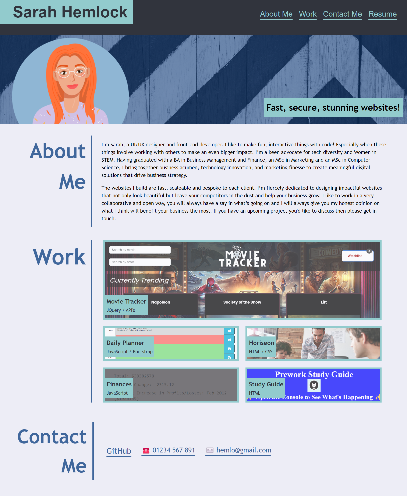
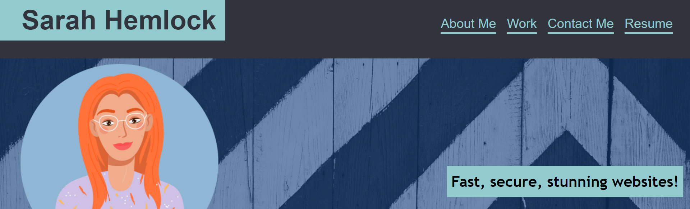
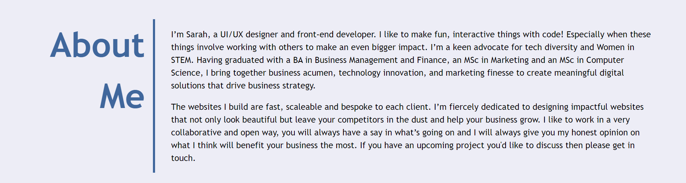
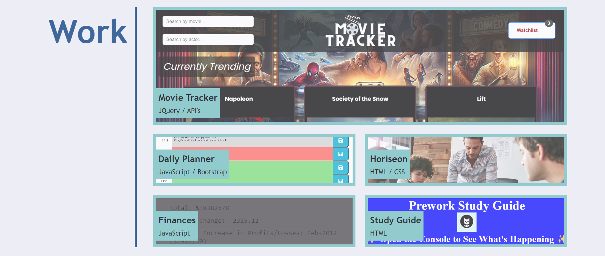
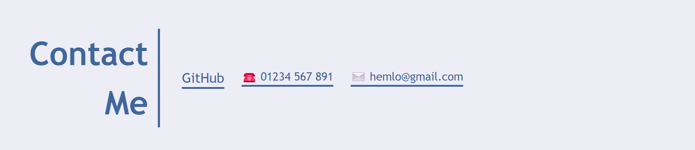
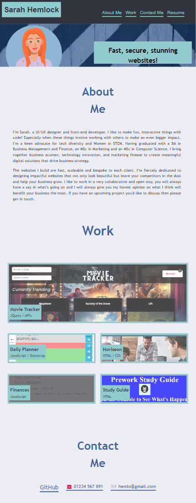
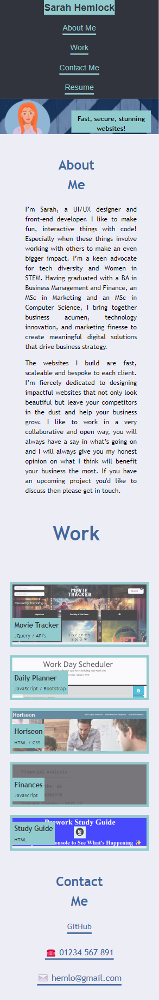

# CSS Portfolio

The link to the deployed application is availble here: https://shemlock.github.io/css-portfolio/

## Description

Provide a short description explaining the what, why, and how of your project. Use the following questions as a guide:

- What was your motivation?
- Why did you build this project? (Note: the answer is not "Because it was a homework assignment.")
- What problem does it solve?

  Creating this website helped me learn about: 
  * Flex Box
  * Grid
  * HTML
  * CSS
  * Media Querys 

## Table of Contents

If your README is long, add a table of contents to make it easy for users to find what they need.

- [Installation](#installation)
- [Usage](#usage)
- [Credits](#credits)
- [License](#license)
- [Features](#features)
  
## Installation
N/A

## Usage

* When you open the website at the top right you will find the navigation bar with 4 links: About Me, Work, Contact Me and Resume.
  

* Clicking on Resume will take you to a pdf of my resume. 

* Clicking on About Me will take you to the about me section of the website, where you can read some information about me.
  

  
* Clicking on Work will take you to the work section of the website, where you can view 5 work items from my portolio.
  

* As seen in the video below, hovering over any of the projects will cause the opacity of the image to change and the mouse will change from a curser to a pointer. Click on the project image or title and you will be taken to the live deployed website. 

https://github.com/shemlock/css-portfolio/assets/147415364/bf5c5ec9-8f22-4288-9858-c71efcd92f54

* Clicking on Contact Me will take you to the contact section of the website, where you find a link to my GitHub profile, email address and phone number.

The website is responsive and suitable for both mobile view and tablet view. 
Here is an example of the website on an iPad air.

Here is an example of the website on an iPhone 12. 

  
## Credits
N/A

## License
MIT 

## Features

* Navigation bar with links to sections of the website, and resume pdf.
* Hero Section with personal avatar. 
* About Me Section with information about myself. 
* Work Section featuring 5 examples of work items, with images and links to the deployed projects.
* Contact Section with link to github, email and phone number.
* Fully responsive UI suitable for laptop, tablet and mobile view. 

